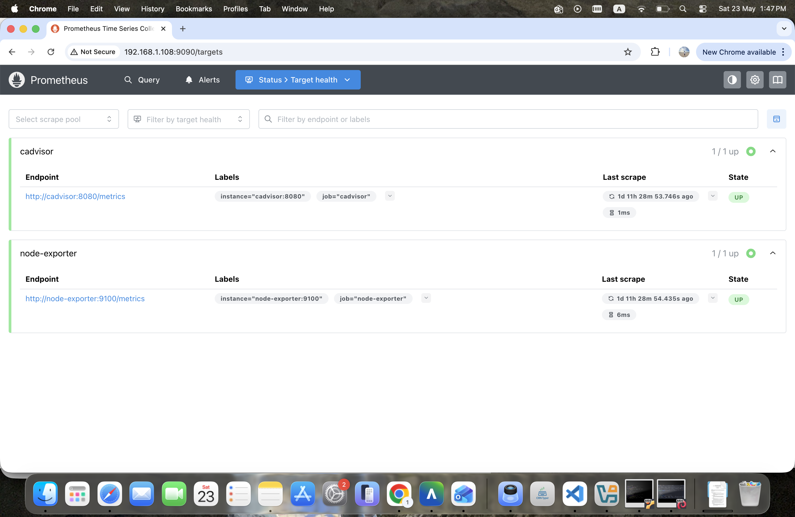
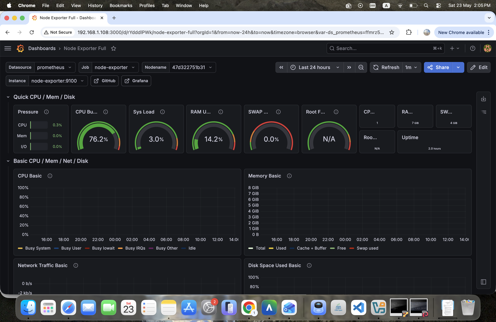
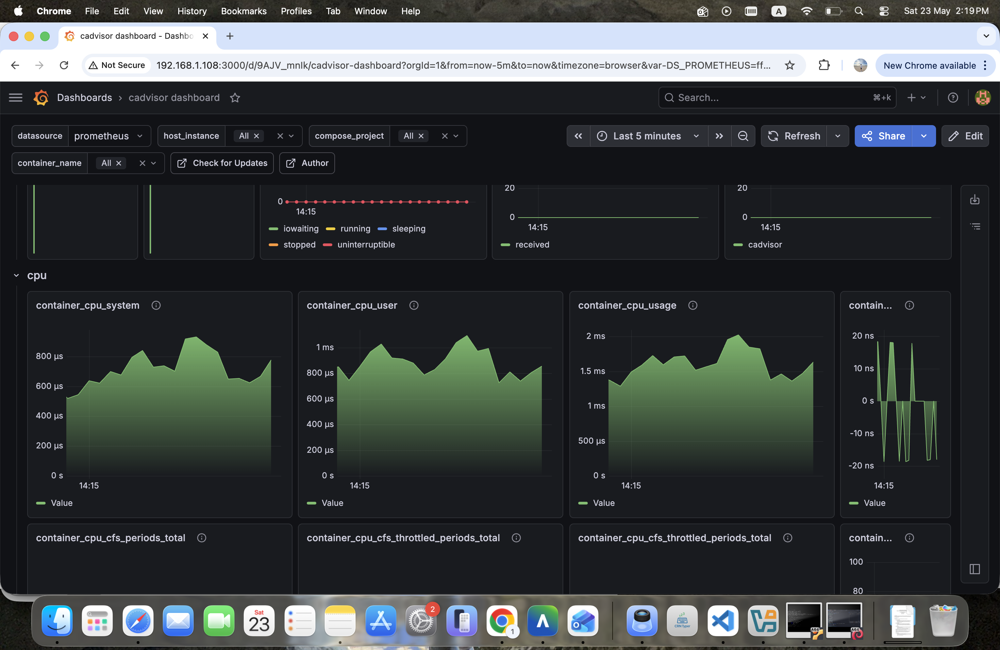
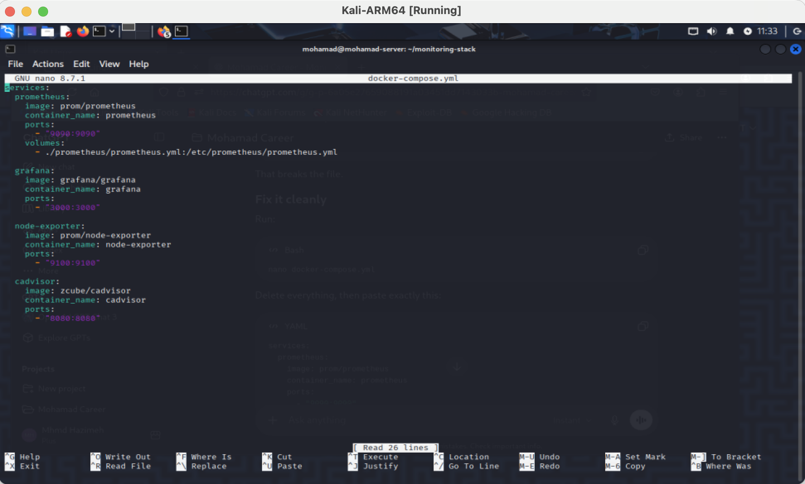
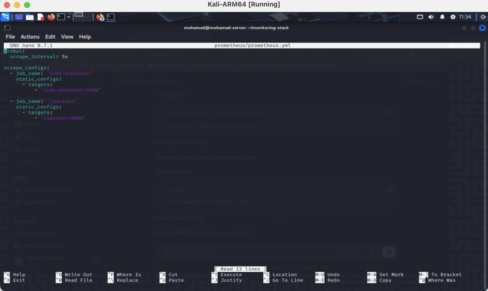
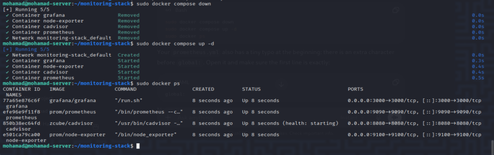

# Production-Style Monitoring Infrastructure Stack

## Overview

This project is a centralized monitoring infrastructure built using Docker Compose to monitor Linux system health, Docker containers, resource usage, uptime, and infrastructure metrics in real time.

The stack simulates a production-style monitoring environment and provides visualization and observability through professional dashboards.

---

## Architecture

Docker Compose Stack:

- Prometheus → Metrics collection and storage
- Grafana → Visualization and dashboards
- Node Exporter → Linux host metrics
- cAdvisor → Docker container monitoring

---

## Infrastructure Components

| Component | Purpose | Port |
|----------|----------|------|
| Grafana | Dashboard Visualization | 3000 |
| Prometheus | Metrics Storage | 9090 |
| Node Exporter | Linux System Metrics | 9100 |
| cAdvisor | Container Metrics | 8080 |

---

## Features

- Centralized infrastructure monitoring
- Real-time system metrics
- Docker container monitoring
- CPU usage analytics
- RAM monitoring
- Uptime tracking
- Network monitoring
- Dashboard visualization
- Time-series metrics storage

---

## Monitoring Workflow

Node Exporter + cAdvisor  
↓  
Prometheus Scraping  
↓  
Metrics Storage  
↓  
Grafana Dashboards

---

## Screenshots

### Prometheus Target Health



---

### Node Exporter Dashboard



---

### Container Monitoring Dashboard



---

### Docker Compose Configuration



---

### Prometheus Configuration



---

### Stack Deployment



---

## Technologies Used

- Linux
- Docker
- Docker Compose
- Prometheus
- Grafana
- Node Exporter
- cAdvisor

---

## Skills Demonstrated

- Infrastructure Monitoring
- Linux Administration
- Docker Containerization
- Observability
- Metrics Collection
- Dashboard Design
- System Administration
- Networking Basics

---

## Run Locally

```bash
docker compose up -d
```

Access:

Grafana:
```
http://localhost:3000
```

Prometheus:
```
http://localhost:9090
```

Node Exporter:
```
http://localhost:9100
```

cAdvisor:
```
http://localhost:8080
```

---

## Author

Mohamad Hazimeh
